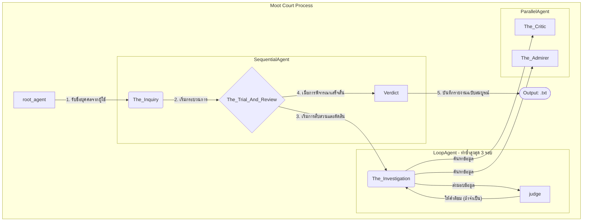

# Multi-agent-systems-with-ADK
This repository implements a multi-agent “Moot Court” system for debating historical figures. Built as a learning project for the Build Multi-Agent Systems with ADK course on Google Cloud Skills Boost, it demonstrates sequential, parallel, and looping agent workflows using Google ADK.

# โครงสร้างและการทำงานของ Moot Court Agent

เอกสารนี้อธิบายโครงสร้างและการทำงานของระบบ multi-agent ที่ออกแบบมาเพื่อจำลองกระบวนการสืบสวนและตัดสินบุคคลในประวัติศาสตร์ (Moot Court)

## โครงสร้าง Agent

แผนภาพด้านล่างแสดงความสัมพันธ์และการไหลของข้อมูลระหว่าง Agent ต่างๆ ในระบบ

## คำอธิบายการทำงาน

1.  **`root_agent`**: เป็น Agent ตัวแรกที่เริ่มต้นการทำงาน โดยจะแนะนำตัวเองและสอบถามผู้ใช้ว่าต้องการสืบสวนบุคคลในประวัติศาสตร์ท่านใด จากนั้นจะบันทึกชื่อบุคคลนั้นและส่งต่อการทำงานไปยัง `The_Inquiry`
2.  **`The_Inquiry` (SequentialAgent)**: ทำหน้าที่ควบคุมกระบวนการทั้งหมดตามลำดับ โดยจะเริ่มจาก `The_Trial_And_Review` ก่อน แล้วจึงตามด้วย `Verdict`
3.  **`The_Trial_And_Review` (LoopAgent)**: เป็นกระบวนการพิจารณาคดีที่ทำซ้ำได้ (สูงสุด 3 รอบ) ประกอบด้วย 2 ขั้นตอนย่อย:
    *   **`The_Investigation` (ParallelAgent)**: Agent `The_Critic` และ `The_Admirer` จะทำงานพร้อมกันเพื่อรวบรวมข้อมูล
        *   **`The_Critic`**: ค้นหาข้อมูลเกี่ยวกับข้อโต้แย้งและผลกระทบในด้านลบของบุคคลนั้นๆ
        *   **`The_Admirer`**: ค้นหาข้อมูลเกี่ยวกับความสำเร็จและคุณูปการในด้านบวก
    *   **`judge`**: ทำหน้าที่ประเมินข้อมูลจากทั้งสองฝ่าย หากข้อมูลยังไม่สมดุลหรือไม่ละเอียดพอ จะให้คำติชม (Critical Feedback) เพื่อให้ `The_Investigation` กลับไปค้นหาข้อมูลเพิ่มเติมในรอบถัดไป แต่ถ้าข้อมูลครบถ้วนและสมดุลแล้ว จะสังเคราะห์ข้อมูลทั้งหมดเป็น "คำตัดสินฉบับสุดท้าย" (Final Verdict) และจบการทำงานของ Loop
4.  **`Verdict`**: Agent สุดท้ายที่จะดึงรายงาน "Final Verdict" จาก `judge` มาบันทึกเป็นไฟล์ `.txt` ลงในไดเรกทอรี `moot_court_reports`
